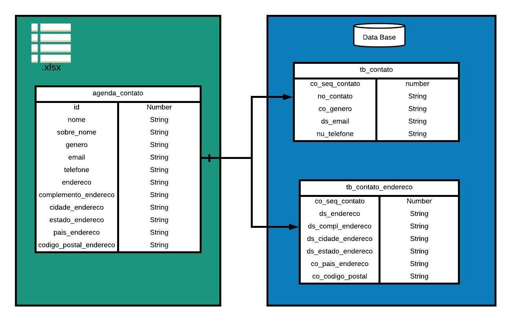
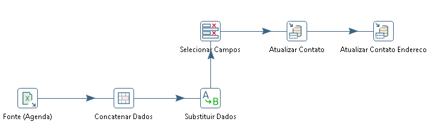

# Agenda de Contatos

---

## Objetivo do Projeto

O objetivos deste ETL é captar os dados de uma planilha de Excel, transformá-los atendendo os requisitos exigidos no projeto e disponibiliza-los em duas tabelas em um Banco de Dados SQLite. Para isso será utilizado a ferramenta de integração Pentaho PDI.

---

## Requisitos do Projeto

1. Os campos NOME e SOBRE_NOME devem ser concatenados e o resultado deverá ser armazenado no banco de dados.
2. No campo GENERO, a palavra MALE deverá ser armazenada no bando de dados com o valor 'M' e a palavra FEMALE deverá receber o valor 'F'

---

## Estrutura do Projeto

- Agenda
    - arquivos
        - agenda_contato.xlsx (origem dos dados)
    - db
        - agenda.db (banco de dados)
        - ScriptSQLite.sql (script para criação do banco de dados)
    - agendaConsulta.ktr (ETL)

---

## Steps do ETL

- Microsoft Excel Input
- Concat Fields
- Value Mapper
- Replace in String
- Select Values
- Table Output
- Update/Insert
- Database Lookup

---

## Fluxograma do ETL

  

---

## Diagrama do ETL

  

