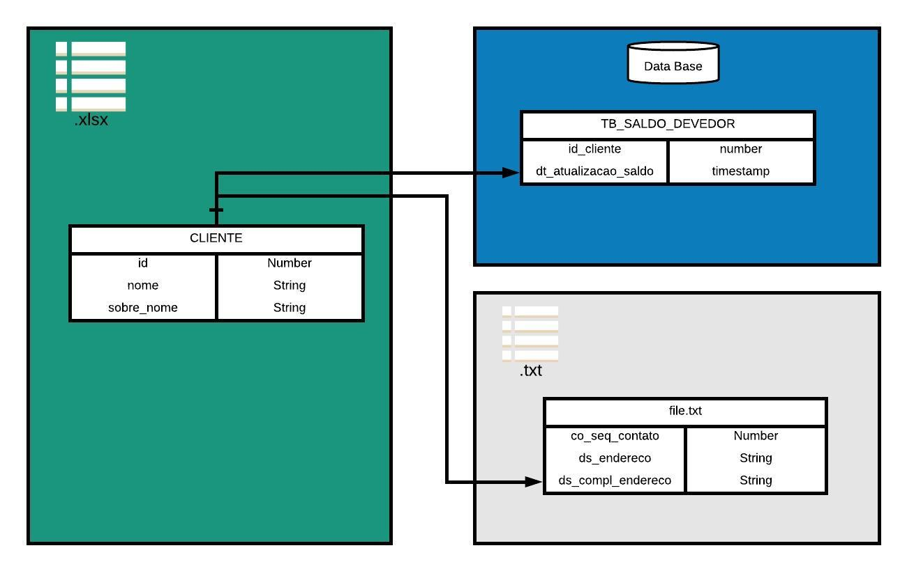
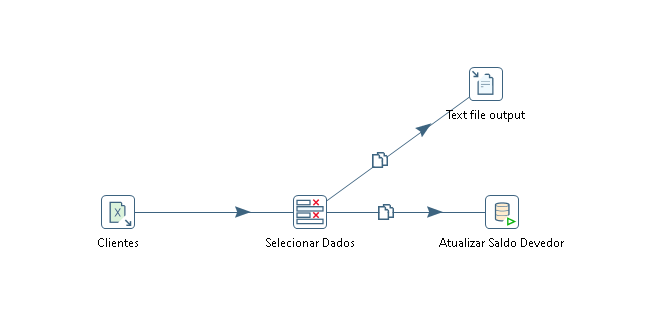

# Distribuição Simples

---

## Objetivo do Projeto

O objetivos deste ETL é captar os dados de uma planilha de Excel, e grava-los em um arquivo txt e em uma banco de dados simultaneamente..

---

## Requisitos do Projeto

1. Os dados deveram ser captados em uma planilha e disponibilizados em um arquivo txt e um banco de dados.

---

## Estrutura do Projeto

- Distribuição Simples
    - Arquivos
        - CLIENTES.xlsx (origem dos dados)
    - db
        - Script.sql (procedure utilizada na step)
    - copiarColar.ktr (ETL)

---

## Steps do ETL

- Microsoft Excel Input
- Select Values
- Text file Output
- Call DB Procedure

---

## Fluxograma do ETL

  

---

## Diagrama do ETL

  

